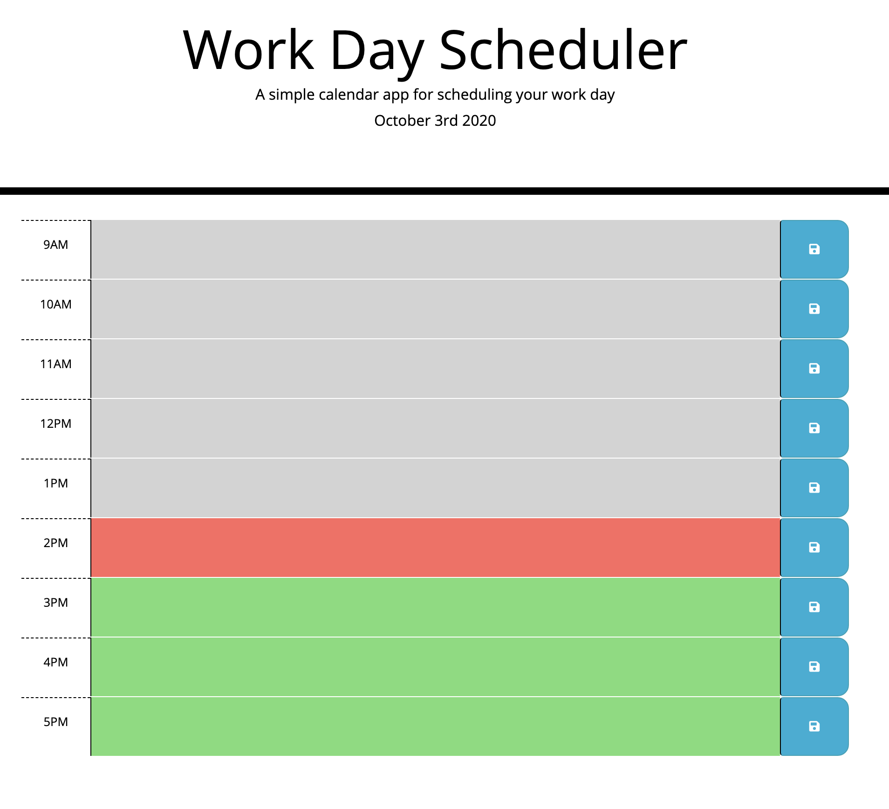
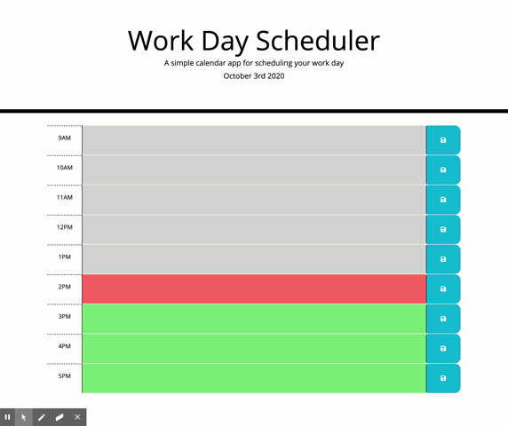

# Workday Scheduler

Explore the [project page](https://github.com/cynthiwu/work-day-scheduler)

View it live on [github-pages](https://cynthiwu.github.io/work-day-scheduler/)

## Table of Contents
- [About The Project](#about-the-project)
  - [Acceptance Criteria](#acceptance-criteria)
- [Usage](#usage)
  - [Demo](#demo)
- [Built With](#built-with)
- [Contributing](#contributing)
- [Contact](#contact)


## About The Project

The goal of this project was to create a simple workday scheduler. The scheduler has a row to represent each hour of the typical workday (i.e., 9AM to 5PM) where the user can enter and save tasks for that given hour. Each hour is color-coded based on whether it has passed, is current, or is in the future. 

<hr>



<hr>

### Acceptance Criteria

The below were the acceptance criteria for this project:

```
GIVEN I am using a daily planner to create a schedule
WHEN I open the planner
THEN the current day is displayed at the top of the calendar
WHEN I scroll down
THEN I am presented with time blocks for standard business hours
WHEN I view the time blocks for that day
THEN each time block is color-coded to indicate whether it is in the past, present, or future
WHEN I click into a time block
THEN I can enter an event
WHEN I click the save button for that time block
THEN the text for that event is saved in local storage
WHEN I refresh the page
THEN the saved events persist
```


## Usage

This project can be used by anyone who wishes to visually keep track of their work tasks over the day. The data will persist over a browser refresh for later use. 

### Demo

Watch the gif below to see how the quiz works. 




## Built With

* This project was built using [Bootstrap](https://getbootstrap.com/).


## Contact

Cynthia Wu - [@cynthia21wu](https://twitter.com/cynthia21wu) - cynthia21wu@gmail.com

Project Link: [https://github.com/cynthiwu/work-day-scheduler](https://github.com/cynthiwu/work-day-scheduler)
